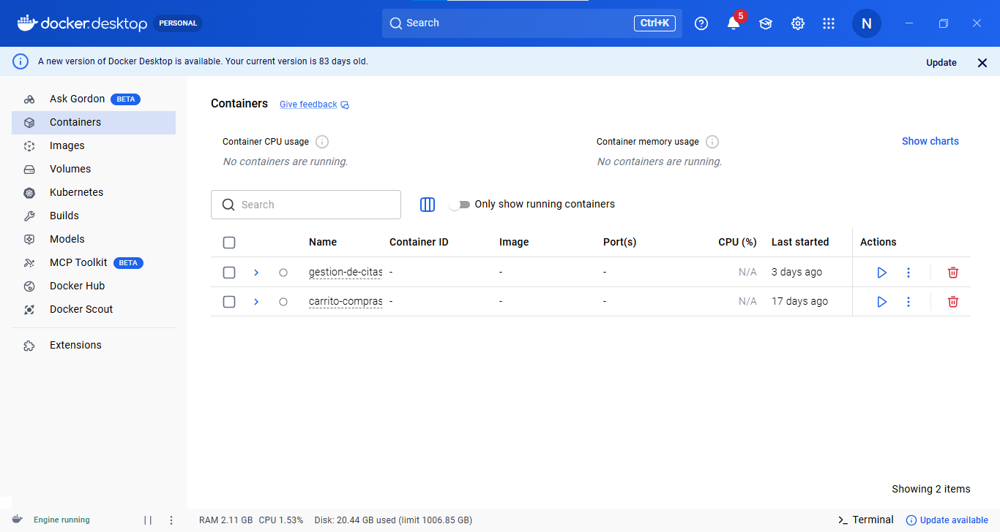
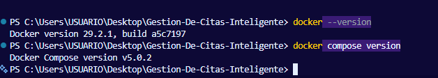
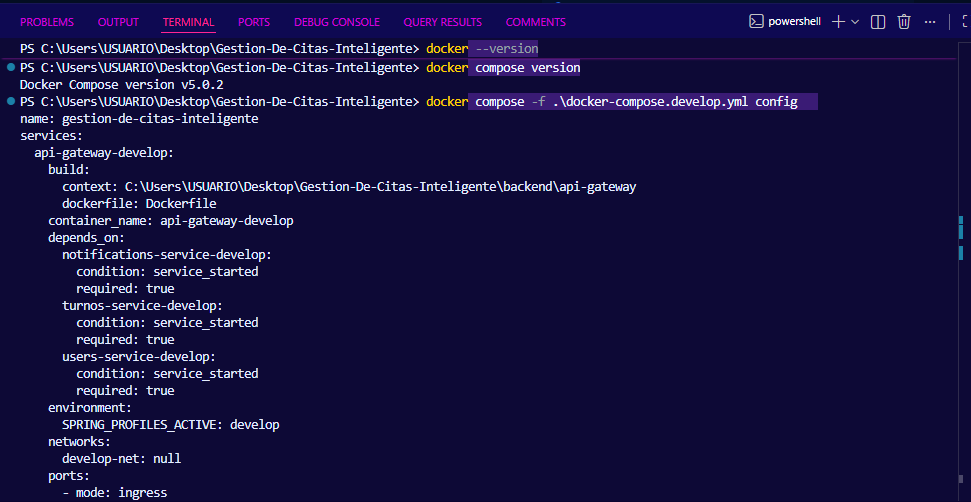
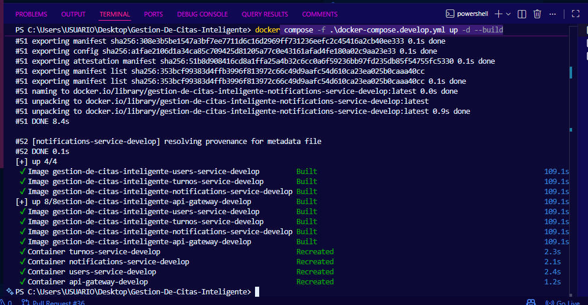
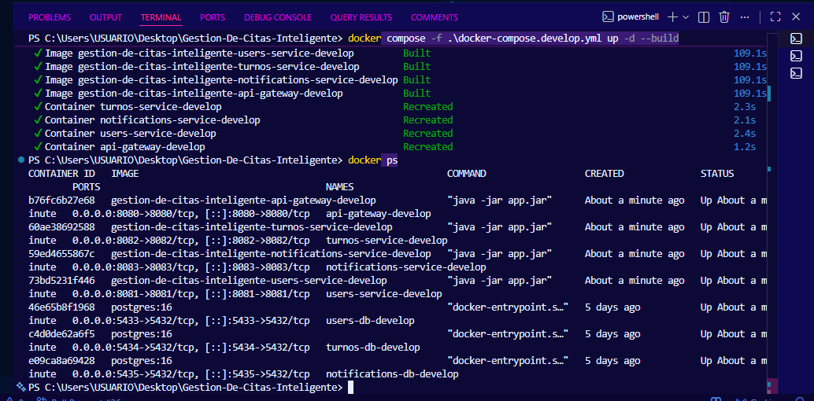
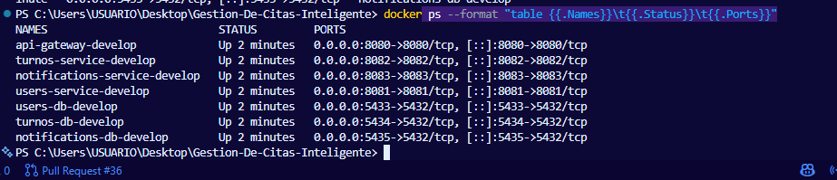

# HU-01: Guia para ejecutar el backend con Docker

## Historia de usuario

Como integrante del equipo de desarrollo, quiero tener una guia clara para ejecutar el backend con Docker, para que cualquier compañero pueda levantar el proyecto sin configurar bases de datos manualmente.

## Objetivo

Documentar los pasos principales para ejecutar el proyecto Gestion de Citas Inteligente usando Docker Compose en el ambiente develop.

## Criterios de aceptacion

- Se indican las herramientas necesarias.
- Se documentan los comandos para clonar y actualizar el proyecto.
- Se documenta el comando para levantar el ambiente develop.
- Se explican los puertos principales del ambiente develop.
- Se indica como verificar los contenedores activos.
- No se modifica codigo fuente del proyecto.

## Herramientas necesarias

- Git
- Docker Desktop
- Postman
- Visual Studio Code

## Clonar el proyecto

git clone https://github.com/Corhuila-Gestion-Citas/Gestion-De-Citas-Inteligente.git

cd Gestion-De-Citas-Inteligente

git checkout develop

git pull origin develop

## Verificar Docker

Antes de levantar el proyecto se debe abrir Docker Desktop.

Luego se verifican las versiones:

docker --version

docker compose version

## Levantar ambiente develop

Desde la raiz del proyecto:

docker compose -f .\docker-compose.develop.yml config

docker compose -f .\docker-compose.develop.yml up -d --build

## Verificar contenedores activos

docker ps

Tambien se puede usar:

docker ps --format "table {{.Names}}\t{{.Status}}\t{{.Ports}}"

## Puertos del ambiente develop

| Servicio | Puerto |
|---|---|
| API Gateway | 8080 |
| Users Service | 8081 |
| Turnos Service | 8082 |
| Notifications Service | 8083 |
| Users DB | 5433 |
| Turnos DB | 5434 |
| Notifications DB | 5435 |

## Resultado esperado

El ambiente develop debe quedar levantado con los microservicios y bases de datos funcionando en Docker.

## Evidencias

- Captura de Docker Desktop activo.
- Captura del comando docker ps.
- Captura de los contenedores del proyecto funcionando.
- Captura de los puertos expuestos.

## Conclusion

Esta historia de usuario aporta documentacion tecnica para que el equipo pueda ejecutar el proyecto rapidamente y evitar errores al momento de probar o exponer.

## Evidencias realizadas

### 1. Docker Desktop activo

### 2. Versiones de Docker

### 3. Validacion del docker-compose develop

### 4. Ambiente develop levantado

### 5. Contenedores activos

### 6. Puertos expuestos

