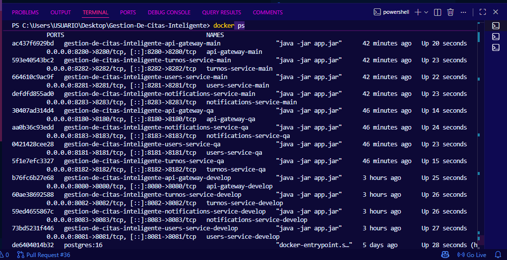
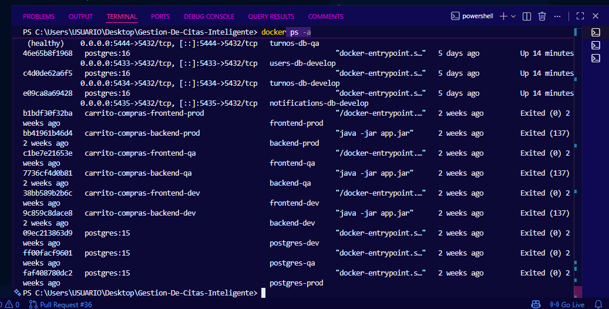
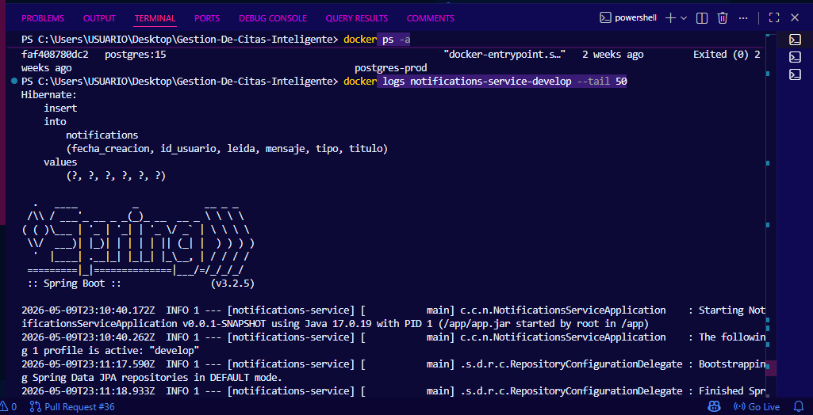
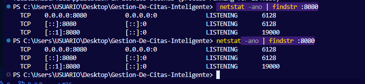
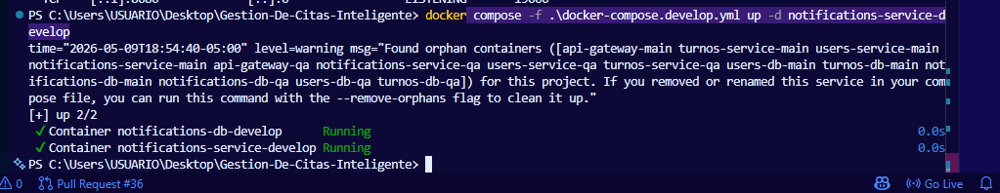

# HU-04: Guia de solucion de errores comunes en Docker

## Historia de usuario

Como integrante del equipo de desarrollo, quiero tener una guia de solucion de errores comunes en Docker, para identificar rapidamente problemas de contenedores, puertos ocupados o servicios que no inician antes de una entrega.

## Objetivo

Documentar comandos basicos para diagnosticar errores frecuentes al ejecutar el backend del proyecto Gestion de Citas Inteligente con Docker.

## Criterios de aceptacion

- Se documenta como ver contenedores activos y detenidos.
- Se documenta como revisar logs de un contenedor.
- Se documenta como identificar puertos ocupados.
- Se documenta como detener un proceso que ocupa un puerto.
- Se documenta como reiniciar un servicio especifico.
- No se modifica codigo fuente del proyecto.

## Ver contenedores activos

docker ps

## Ver todos los contenedores, incluyendo detenidos

docker ps -a

## Ver logs de un contenedor

docker logs nombre-del-contenedor

Ejemplo:

docker logs notifications-service-develop

## Revisar si un puerto esta ocupado

Ejemplo con el puerto del API Gateway develop:

netstat -ano | findstr :8080

## Finalizar un proceso que ocupa un puerto

taskkill /PID NUMERO /F

## Reiniciar un servicio especifico

Develop:

docker compose -f .\docker-compose.develop.yml up -d notifications-service-develop

QA:

docker compose -f .\docker-compose.qa.yml up -d notifications-service-qa

Main:

docker compose -f .\docker-compose.main.yml up -d notifications-service-main

## Apagar un ambiente sin borrar volumenes

Develop:

docker compose -f .\docker-compose.develop.yml down

QA:

docker compose -f .\docker-compose.qa.yml down

Main:

docker compose -f .\docker-compose.main.yml down

## Advertencia

No se recomienda usar `down -v` durante pruebas normales, porque elimina los volumenes y puede borrar la informacion almacenada en las bases de datos.

## Resultado esperado

El equipo debe poder identificar errores basicos de Docker y aplicar soluciones rapidas sin afectar el codigo fuente del proyecto.

## Evidencias sugeridas

- Captura de `docker ps`.
- Captura de `docker ps -a`.
- Captura de logs de un contenedor.
- Captura de revision de puerto con `netstat`.
- Captura de reinicio de un servicio especifico.

## Conclusion

Esta historia ayuda a reducir el tiempo de solucion de problemas durante pruebas y exposiciones, dejando comandos claros para diagnosticar contenedores, logs y puertos ocupados.

## Evidencias realizadas

Las siguientes evidencias fueron tomadas para comprobar que la guia de solucion de errores comunes en Docker permite diagnosticar problemas relacionados con contenedores, logs, puertos ocupados y reinicio de servicios.

Las capturas se encuentran guardadas en la carpeta `capturashu4`.

### Evidencia 1: Contenedores activos con docker ps

Esta evidencia muestra los contenedores activos del proyecto mediante el comando `docker ps`.

### Evidencia 2: Contenedores activos y detenidos con docker ps -a

Esta evidencia muestra todos los contenedores existentes, incluyendo los que se encuentran activos y detenidos.

### Evidencia 3: Revision de logs de un contenedor

Esta evidencia muestra la revision de logs de un contenedor del proyecto, lo cual permite identificar errores o validar que el servicio inicio correctamente.

### Evidencia 4: Revision de puerto ocupado con netstat

Esta evidencia muestra la verificacion de un puerto utilizado por el proyecto mediante el comando `netstat`, permitiendo identificar si un puerto esta ocupado por algun proceso.

### Evidencia 5: Reinicio de un servicio especifico

Esta evidencia muestra el reinicio de un servicio especifico usando Docker Compose, sin necesidad de levantar nuevamente todo el ambiente.

## Cierre de evidencias

Con estas capturas se comprueba que la guia permite revisar contenedores activos y detenidos, consultar logs, identificar puertos ocupados y reiniciar servicios especificos. Esto ayuda a solucionar errores comunes de Docker antes de una entrega o exposicion, sin modificar el codigo fuente del proyecto.
