# HU-02: Checklist de pruebas del backend

## Historia de usuario

Como integrante del equipo de desarrollo, quiero tener un checklist de pruebas del backend, para verificar rapidamente que los microservicios, el API Gateway y las bases de datos funcionan antes de una entrega.

## Objetivo

Crear una lista de verificacion rapida para probar el proyecto Gestion de Citas Inteligente usando Docker, Postman y Liquibase.

## Criterios de aceptacion

- Se incluyen pruebas rapidas por navegador.
- Se incluyen pruebas basicas por Postman.
- Se incluyen comandos para verificar Liquibase.
- Se incluyen comandos para revisar errores comunes.
- No se modifica codigo fuente del proyecto.

## Pruebas rapidas por navegador

Con el ambiente develop levantado, se pueden probar estas rutas:

http://localhost:8080/users

http://localhost:8080/turnos

http://localhost:8080/notifications

Si alguna ruta responde con una lista vacia, por ejemplo [], significa que el servicio esta funcionando y la base de datos no tiene registros.

## Pruebas por Postman

### Crear usuario

Metodo:

POST

URL:

http://localhost:8080/users

Body JSON:

{
  "nombre": "Usuario Develop",
  "email": "develop@test.com",
  "password": "123456",
  "rol": "CLIENTE"
}

### Login

POST http://localhost:8080/users/login

Body JSON:

{
  "email": "develop@test.com",
  "password": "123456"
}

### Crear turno

POST http://localhost:8080/turnos

Body JSON:

{
  "doctor": "Dr. Carlos Ramirez",
  "especialidad": "Medicina General",
  "fechaHora": "2026-05-20T09:00:00",
  "idUsuario": 1
}

### Listar turnos

GET http://localhost:8080/turnos

### Crear notificacion

POST http://localhost:8080/notifications

Body JSON:

{
  "idUsuario": 1,
  "titulo": "Turno creado",
  "mensaje": "Tu turno fue creado correctamente",
  "tipo": "CREACION_TURNO"
}

### Listar notificaciones

GET http://localhost:8080/notifications

## Pruebas directas sin API Gateway

GET http://localhost:8081/users

GET http://localhost:8082/turnos

GET http://localhost:8083/notifications

## Verificar Liquibase

Users DB:

docker exec -it users-db-develop psql -U postgres -d usersdb_develop -c "SELECT id, author, filename, dateexecuted FROM databasechangelog;"

Turnos DB:

docker exec -it turnos-db-develop psql -U postgres -d turnosdb_develop -c "SELECT id, author, filename, dateexecuted FROM databasechangelog;"

Notifications DB:

docker exec -it notifications-db-develop psql -U postgres -d notificationsdb_develop -c "SELECT id, author, filename, dateexecuted FROM databasechangelog;"

Si aparecen registros en la tabla databasechangelog, significa que Liquibase ejecuto correctamente las migraciones.

## Errores comunes

Ver todos los contenedores:

docker ps -a

Ver logs de un contenedor:

docker logs nombre-del-contenedor

Ejemplo:

docker logs notifications-service-develop

Revisar puerto ocupado:

netstat -ano | findstr :8080

Cerrar proceso:

taskkill /PID NUMERO /F

## Resultado esperado

El equipo debe poder validar rapidamente que users-service, turnos-service, notifications-service, API Gateway y Liquibase funcionan correctamente.

## Evidencias

- Captura de pruebas en navegador.
- Captura de pruebas en Postman.
- Captura del comando docker ps.
- Captura de Liquibase consultando databasechangelog.

## Conclusion

Esta historia ayuda a preparar entregas y exposiciones porque deja una guia rapida para verificar el funcionamiento del backend.

## Evidencias realizadas

Las siguientes evidencias fueron tomadas para comprobar que el checklist de pruebas del backend permite verificar el funcionamiento de los microservicios, el API Gateway, Docker y Liquibase.

Las capturas se encuentran guardadas en la carpeta `capturashu2`.

### Evidencia 1: Prueba Users por navegador

Esta evidencia muestra la prueba del endpoint de usuarios desde el API Gateway.

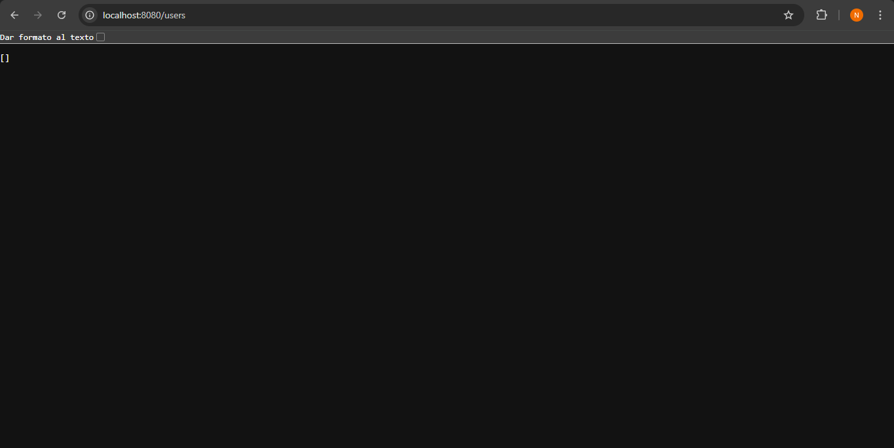

### Evidencia 2: Prueba Turnos por navegador

Esta evidencia muestra la prueba del endpoint de turnos desde el API Gateway.

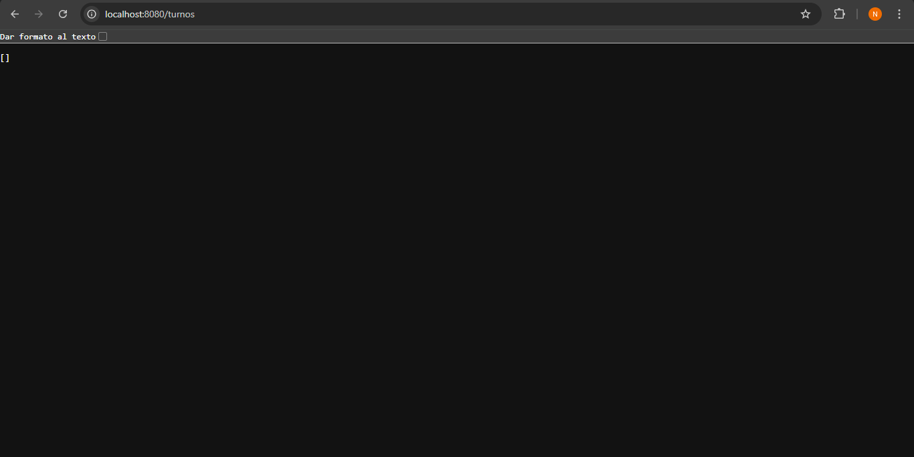

### Evidencia 3: Prueba Notifications por navegador

Esta evidencia muestra la prueba del endpoint de notificaciones desde el API Gateway.

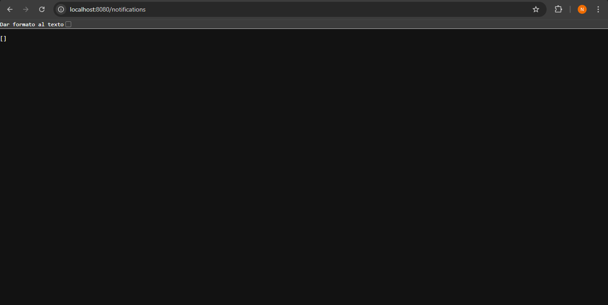

### Evidencia 4: Creacion de usuario en Postman

Esta evidencia muestra la prueba para crear un usuario desde Postman.

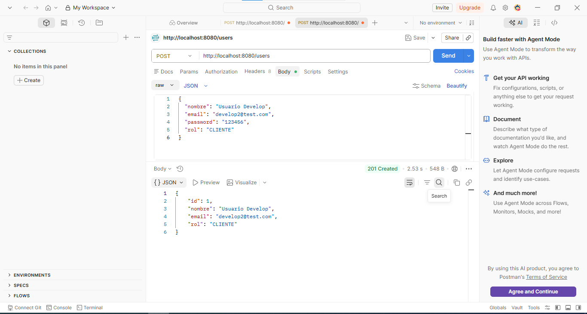

### Evidencia 5: Login de usuario en Postman

Esta evidencia muestra la prueba de inicio de sesion desde Postman.

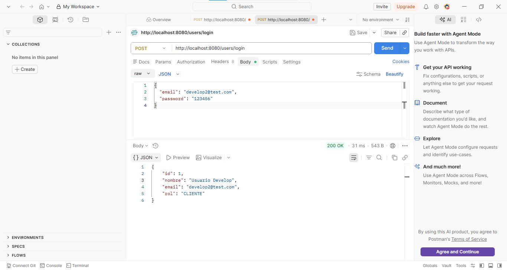

### Evidencia 6: Creacion de turno en Postman

Esta evidencia muestra la prueba para crear un turno desde Postman.

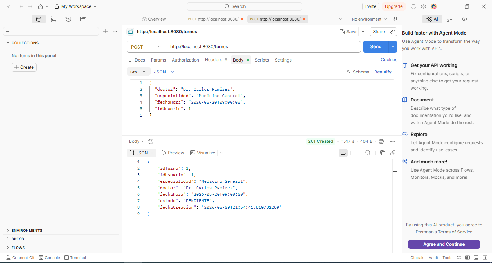

### Evidencia 7: Creacion de notificacion en Postman

Esta evidencia muestra la prueba para crear una notificacion desde Postman.

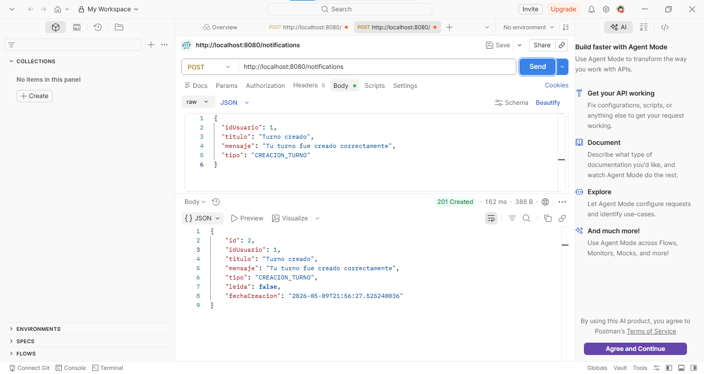

### Evidencia 8: Contenedores activos con docker ps

Esta evidencia muestra los contenedores activos del proyecto mediante el comando `docker ps`.

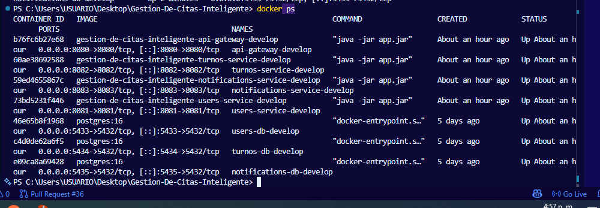

### Evidencia 9: Verificacion de Liquibase en Users DB

Esta evidencia muestra la consulta a la tabla `databasechangelog` de la base de datos de usuarios.

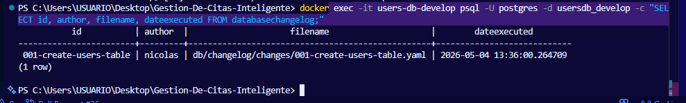

### Evidencia 10: Verificacion de Liquibase en Turnos DB

Esta evidencia muestra la consulta a la tabla `databasechangelog` de la base de datos de turnos.

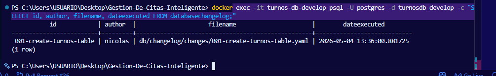

### Evidencia 11: Verificacion de Liquibase en Notifications DB

Esta evidencia muestra la consulta a la tabla `databasechangelog` de la base de datos de notificaciones.

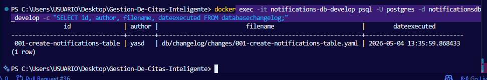

## Cierre de evidencias

Con estas capturas se comprueba que el checklist permite validar el funcionamiento del API Gateway, los microservicios principales, las pruebas basicas por Postman, los contenedores activos y las migraciones ejecutadas por Liquibase.
