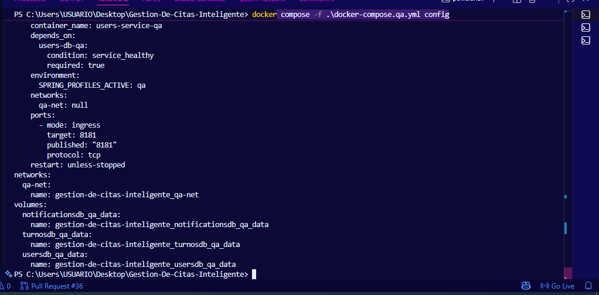
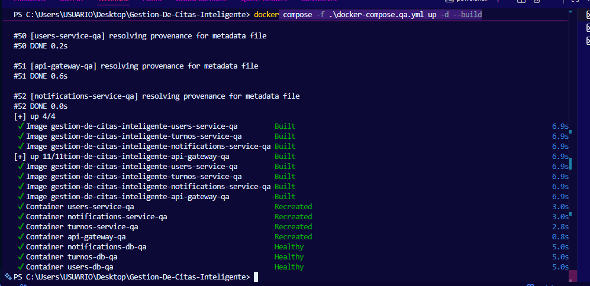
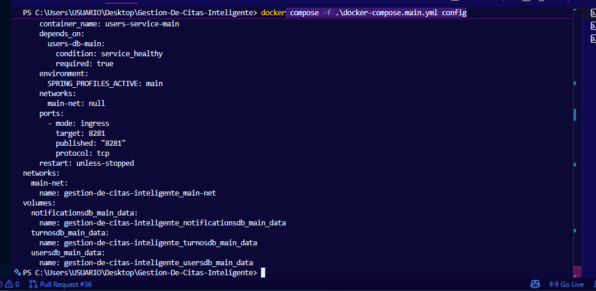
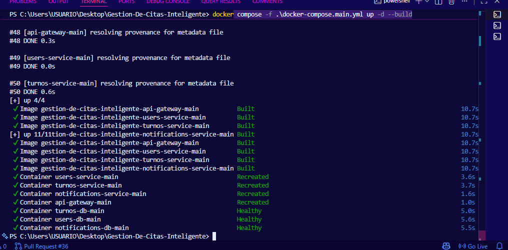
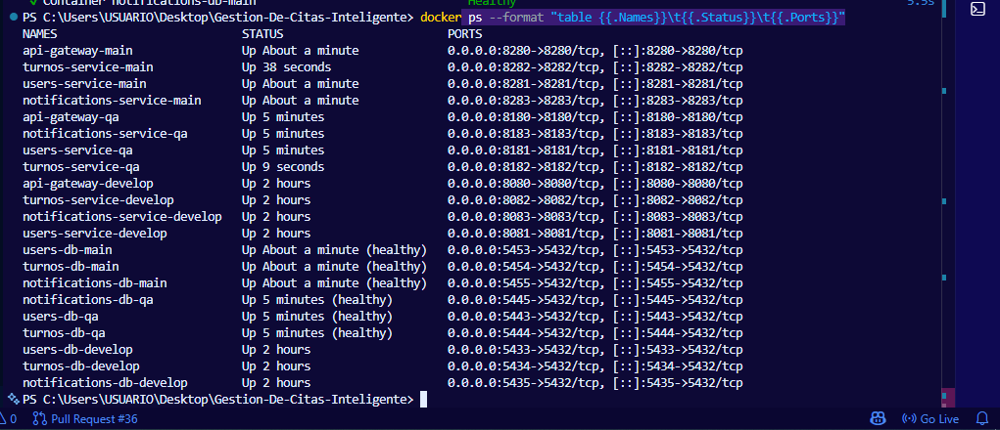

# HU-03: Guia para ejecutar los ambientes QA y Main con Docker

## Historia de usuario

Como integrante del equipo de desarrollo, quiero tener una guia para ejecutar los ambientes QA y Main con Docker, para comprobar que el sistema puede trabajar en diferentes entornos sin modificar manualmente la configuracion.

## Objetivo

Documentar los comandos necesarios para levantar y verificar los ambientes QA y Main del proyecto Gestion de Citas Inteligente usando Docker Compose.

## Criterios de aceptacion

- Se documenta el comando para validar el archivo docker-compose.qa.yml.
- Se documenta el comando para levantar el ambiente QA.
- Se documenta el comando para validar el archivo docker-compose.main.yml.
- Se documenta el comando para levantar el ambiente Main.
- Se indican los puertos usados por cada ambiente.
- No se modifica codigo fuente del proyecto.

## Ambiente QA

Validar configuracion:

docker compose -f .\docker-compose.qa.yml config

Levantar ambiente QA:

docker compose -f .\docker-compose.qa.yml up -d --build

Verificar contenedores:

docker ps --format "table {{.Names}}\t{{.Status}}\t{{.Ports}}"

## Puertos QA

| Servicio | Puerto |
|---|---|
| API Gateway | 8180 |
| Users Service | 8181 |
| Turnos Service | 8182 |
| Notifications Service | 8183 |
| Users DB | 5443 |
| Turnos DB | 5444 |
| Notifications DB | 5445 |

## Ambiente Main

Validar configuracion:

docker compose -f .\docker-compose.main.yml config

Levantar ambiente Main:

docker compose -f .\docker-compose.main.yml up -d --build

Verificar contenedores:

docker ps --format "table {{.Names}}\t{{.Status}}\t{{.Ports}}"

## Puertos Main

| Servicio | Puerto |
|---|---|
| API Gateway | 8280 |
| Users Service | 8281 |
| Turnos Service | 8282 |
| Notifications Service | 8283 |
| Users DB | 5453 |
| Turnos DB | 5454 |
| Notifications DB | 5455 |

## Resultado esperado

Los ambientes QA y Main deben quedar activos con sus servicios y bases de datos funcionando en puertos diferentes, evitando conflictos con el ambiente develop.

## Evidencias sugeridas

- Captura de validacion del docker-compose.qa.yml.
- Captura de ambiente QA levantado.
- Captura de validacion del docker-compose.main.yml.
- Captura de ambiente Main levantado.
- Captura de docker ps mostrando puertos QA y Main.

## Conclusion

Esta historia aporta una guia practica para demostrar que el proyecto puede ejecutarse en varios ambientes mediante Docker Compose, manteniendo separados los puertos y servicios de QA y Main.

## Evidencias realizadas

Las siguientes evidencias fueron tomadas para comprobar que los ambientes QA y Main
## Evidencias realizadas

Las siguientes evidencias fueron tomadas para comprobar que los ambientes QA y Main pueden ejecutarse correctamente con Docker Compose, usando archivos de configuración separados y puertos diferentes para evitar conflictos entre entornos.

Las capturas se encuentran guardadas en la carpeta `capturashu3`.

### Evidencia 1: Validacion del docker-compose QA

Esta evidencia muestra la validacion del archivo `docker-compose.qa.yml` mediante el comando `docker compose config`, comprobando que la configuracion del ambiente QA no presenta errores.

### Evidencia 2: Levantamiento del ambiente QA

Esta evidencia muestra la ejecucion del comando para construir y levantar los contenedores del ambiente QA con Docker Compose.

### Evidencia 3: Validacion del docker-compose Main

Esta evidencia muestra la validacion del archivo `docker-compose.main.yml`, comprobando que la configuracion del ambiente Main se encuentra correctamente definida.

### Evidencia 4: Levantamiento del ambiente Main

Esta evidencia muestra la ejecucion del comando para construir y levantar los contenedores del ambiente Main con Docker Compose.

### Evidencia 5: Puertos QA y Main activos

Esta evidencia muestra los contenedores activos y los puertos expuestos de los ambientes QA y Main mediante el comando `docker ps --format`.

## Cierre de evidencias

Con estas capturas se comprueba que los ambientes QA y Main fueron validados y levantados correctamente mediante Docker Compose. Tambien se evidencia que cada ambiente utiliza puertos diferentes para el API Gateway, los microservicios y las bases de datos, permitiendo ejecutar varios entornos del proyecto sin modificar el codigo fuente ni generar conflictos de puertos.
